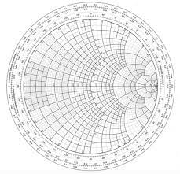

# Notes about RF

Mostly taken from the fantastic Rohde & Schwarz youtube channel. Mostly working mathjax to express the formulas.

This makes the most sense if they're read (or viewed on youtube) in this order:
- S Params
- VSWR
- Smith Charts

