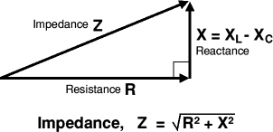
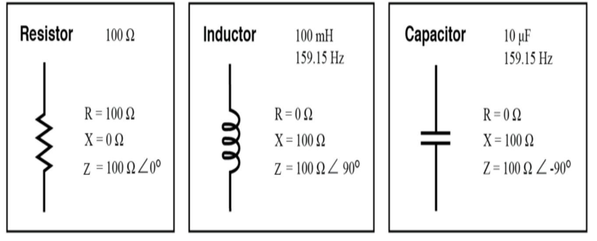

# R, X, and Z - Resistance, Reactance and Impedance

R - Resistance
X - Reactance
Z - Impedance

mostly taken from:  
https://www.allaboutcircuits.com/textbook/alternating-current/chpt-5/review-of-r-x-and-z/

Four electrical quantities determine the impedance (Z) of a circuit: 
- resistance (R)
- capacitance (C)
- inductance (L)
- frequency (f)

## Impedance

Impedance (symbol Z) is a measure of the overall opposition of a circuit to current, in other words: how much the circuit impedes the flow of charge. It is like resistance, but it also takes into account the effects of capacitance and inductance. Impedance is measured in ohms (ohm).

Impedance is more complex than resistance because the effects of capacitance and inductance vary with the frequency of the current passing through the circuit and this means impedance varies with frequency. The effect of resistance is constant regardless of frequency.

- Impedance is a comprehensive expression of any and all forms of opposition to current flow, *including both resistance and reactance*. 
- It is present in all circuits, and in all components.

 When the alternating current goes through an impedance, a voltage drop is produced that is somewhere between 0° and 90° out of phase with the current. Impedance is mathematically symbolized by the letter “Z” and is measured in the unit of ohms (Ω), in complex form.

The capacitance and inductance cause a *Phase Shift* between the current and voltage which means that the resistance and reactance cannot be simply added up to give impedance. Instead they must be added as vectors with reactance at right angles to resistance as shown in the diagram.

## Resistance

This is essentially *friction against the flow of current*.

 It is present in all conductors to some extent (except superconductors!), most notably in resistors. When the alternating current goes through a resistance, a voltage drop is produced that is in-phase with the current. Resistance is mathematically symbolized by the letter “R” and is measured in the unit of ohms (Ω).

 - constant regardless of frequency

## Reactance

This is essentially *inertia against the flow of current*.

 It is present anywhere electric or magnetic fields are developed in proportion to an applied voltage or current, respectively; but most notably in capacitors and inductors.

When the alternating current goes through a pure reactance, a voltage drop is produced that is 90° out of phase with the current. Reactance is mathematically symbolized by the letter “X” and is measured in the unit of ohms (Ω).

- varies with frequency due to capacitance and inductance

### Perfect circuit elements
- Perfect resistors possess resistance, but not reactance. 
- Perfect inductors and perfect capacitors possess reactance but no resistance. 
- All components possess impedance, and because of this universal quality, it makes sense to translate all component values (resistance, inductance, capacitance) into common terms of impedance as the first step in analyzing an AC circuit.

e.g.

A perfect *Resistor*:
At 100 $\Omega$  

R = 100$\Omega$  
X = 0$\Omega$  
Z = 100$\Omega$ < 0º

A perfect *Inductor*:  
At 100mH, 159.15 Hz

R = 0$\Omega$  
X = 100$\Omega$  
Z = 100$\Omega$ < 90º

A Perfect *Capacitor*:  
At 10$\mu$F, 159.15Hz

R = 0$\Omega$  
X = 100$\Omega$  
Z = 100$\Omega$ < -90º

The impedance *phase angle* for any component is the phase shift between the voltage across that component and current through that component.

- For a perfect resistor, the voltage drop and current are always in phase with each other, and so the impedance angle of a resistor is said to be 0°. 
- For a perfect inductor, voltage drop always leads current by 90°, and so an inductor’s impedance phase angle is said to be +90°.
- For a perfect capacitor, voltage drop always lags current by 90°, and so a capacitor’s impedance phase angle is said to be -90°.

Impedances in AC behave analogously to resistances in DC circuits: they add in series, and they diminish in parallel.

### Phase Shift

*Phase Shift* means that the current and voltage are out of step with each other. 

- Think of charging a capacitor. When the voltage across the capacitor is zero, the current is at a maximum; when the capacitor has charged and the voltage is at a maximum, the current is at a minimum. - The charging and discharging occur continually with AC and the current reaches its maximum shortly before the voltage reaches its maximum: so we say the current leads the voltage.

## Input and Output Impedance (ZIN/ZOUT)
### Input Impedance (ZIN)

Input impedance (ZIN) is the impedance 'seen' by anything connected to the input of a circuit or device (such as an amplifer). It is the combined effect of all the resistance, capacitance and inductance connected to the input inside the circuit or device.

It is normal to use the term 'input impedance' even for simple cases where there is only resistance and the term 'input resistance' could be used instead. In fact it is usually reasonable to assume that an input impedance is just resistance providing the input signal has a low frequency (less than 1kHz).

The effects of capacitance and inductance vary with frequency, so if these are present the input impedance will vary with frequency. The effects of capacitance and inductance are generally most significant at high frequencies.

Usually input impedances should be high, at least ten times the output impedance of the circuit (or component) supplying a signal to the input. This ensures that the input will not 'overload' the source of the signal and reduce the strength (voltage) of the signal by a substantial amount.

### Output Impedance (ZOUT)

The output of any circuit or device is equivalent to an output impedance (ZOUT) in series with a perfect voltage source (VSOURCE). This is called the equivalent circuit and it represents the combined effect of all the voltage sources, resistance, capacitance and inductance connected to the output inside the circuit or device. Note that VSOURCE is usually not the same as the supply voltage Vs.

It is normal to use the term 'output impedance' even for simple cases where there is only resistance and the term 'output resistance' could be used instead. In fact it is usually reasonable to assume that an output impedance is just resistance providing the output signal has a low frequency (less than 1kHz).

### The equivalent circuit of any output

The effects of capacitance and inductance vary with frequency, so if these are present the output impedance will vary with frequency. The effects of capacitance and inductance are generally most significant at high frequencies.

Usually output impedances should be low, less than a tenth of the load impedance connected to the output. If an output impedance is too high it will be unable to supply a sufficiently strong signal to the load because most of the signal's voltage will be 'lost' inside the circuit driving current through the output impedance ZOUT. The load could be a single component or the input impedance of another circuit.

Low output impedance, ZOUT << ZLOAD
Most of VSOURCE appears across the load, very little voltage is 'lost' driving the output current through the output impedance. Usually this is the best arrangement.

Matched impedances, ZOUT = ZLOAD
Half of VSOURCE appears across the load, the other half is 'lost' driving the output current through the output impedance. This arrangement is useful in some situations (such as an amplifier driving a loudspeaker) because it delivers maximum power to the load. Note that an equal amount of power is wasted driving the output current through ZOUT, an efficiency of 50%.

High output impedance, ZOUT >> ZLOAD
Only a small portion of VSOURCE appears across the load, most is 'lost' driving the output current through the output impedance. This arrangement is unsatisfactory.

## Notes
A revised version of Ohm’s Law, based on impedance rather than resistance, looks like this:

E = IZ  
I = $\frac{E}{Z}$  
Z = $\frac{E}{I}$

All quantities expressed in *Complex*, not *Scalar* form

## References
- https://www.allaboutcircuits.com/textbook/alternating-current/chpt-5/review-of-r-x-and-z/
- https://electronicsclub.info/impedance.htm