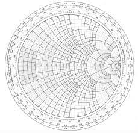
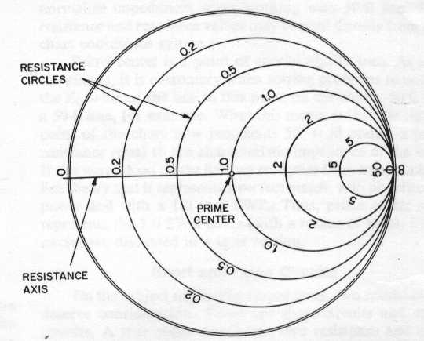
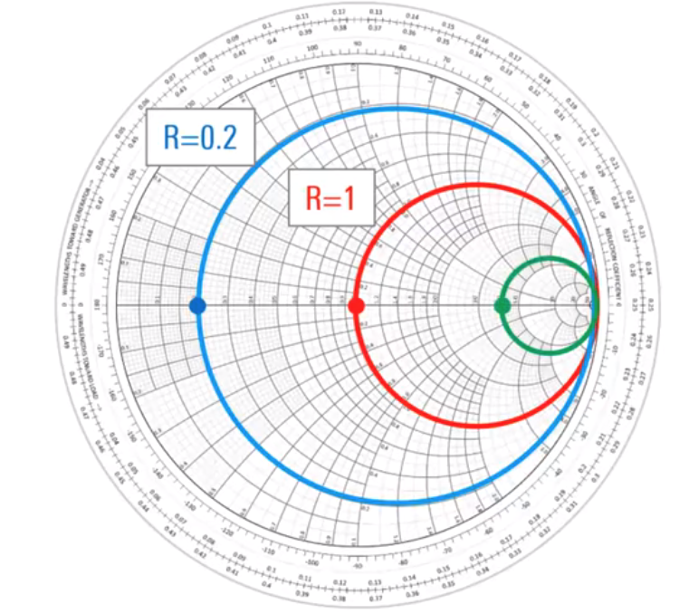
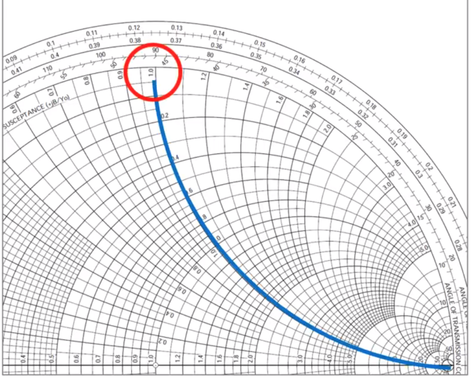
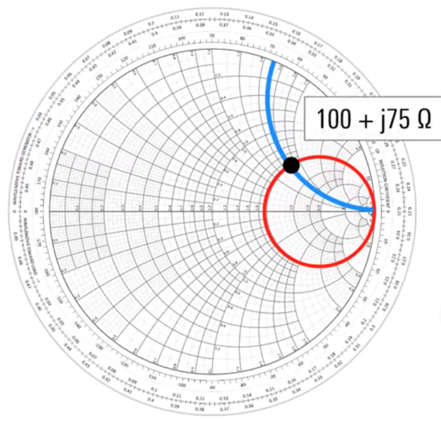

# Smith Charts

Main source material from Rohde & Schwarz

https://www.youtube.com/watch?v=rUDMo7hwihs

Named after Philip Hagar Smith, first described in January 1939  
http://smithchart.org/phsmith.shtml

- When asked why he invented the chart, Smith explained, "From the time I could operate a slide rule, I've been interested in graphical representations of mathematical relationships." 
- In 1969 he published the book Electronic Applications of the Smith Chart: In Waveguide, Circuit, and Component Analysis, a comprehensive work on the subject. He retired from Bell Labs in 1970. 

The Smith Chart:  
- Has many applications.
- the most common are impedance matching and the design of matching networks
- pre-computers this was an intensive process
- the Smith Chart lets you solve the problem graphically with a compass, ruler and pencil
- still useful to help visualize complex impedances, especially as a function of frequency.
- widely used when tuning or verifying the performance of networks

A Smith Chart:
- used when making 1 Port measurements (reflection coefficients e.g. $S_{xy})
- Shows $Z_{L}$ relative to $Z_{0}$
- can be used as
    - a single point
    - traces (impedance as a function of frequency)
- essentially bends the right hand side of a cartesian coordinate plane 
    -  this side is all that would be used in measurement
    - postitive and negative reactance axes (top and bottom half circles) bend around to meet the resistance axis (horizontal/x axis)
    - top half is the Inductive region
    - bottom half is the Capacitative region
    - horizontal (x-axis) is the resistive axis
- A complex impedance appears as a point on a Smith Chart

### layout

### Prime Center
- Point in the middle of chart
- corresponds to the source impedance $Z_{0}$ and a VSWR of 1
- in most RF systems the source is purely resistive 50 $\Omega$ load
- using the Smith Chart this value is normalized to 1.0
- 50 $\Omega$ / 50 == 1
- if the point moves to the right along the resistive axis to 2.0, this corresponds to a resistive value of 2 * 50 or 100 $\Omega$. 
- moving the point to 4.0 would increase the resistive value to 4 * 50 or 200 $\Omega$. 
- All Values on the Smith Chart are normalized by the same Prime Center value.
    - This allows the Chart to be used regardless of impedance (50 $\Omega$  or 75 $\Omega$ etc) 

Significance of the Prime Center:
- ideally $Z_{L}$ = $Z_{0}$ ("matched")
- $Z_{0}$ is always the Prime Center.
- Measured $Z_{L}$ is plotted on the Smith Chart
- The closer the values are to the center the better the impedance match 
- the farther away the values to the center, the higher the degree of mismatch
- when viewing a trace (many points):
    - the load is resonant at the frequency where the trace moves through the center

### Reistive Axis:
- The horizontal centerline
- left of prime center decreases until 0 on the outer edge - A Short Circuit 
- right of prime center increases until the outer edge where it reaches $\infty$ - an Open Circuit
- therefore VSWR is $\infty$ on either end of the resistive axis. 100% reflected power
-

### Resistance Circles:

- Most loads have complex impedances
    - have conductive and inductive characteristics, so not flat on the resistive line

Circle R=1 (red):
- all values within represent a normalized resistance of 1

Circle R=.2 (blue):
- all values within represent a normalized resistance of .2

Circle R=4 (green):
- all values within represent a normalized resistance of 4

and so on.
 
The Normalized Resistance of any point is found by following the resistance circle to the horizontal axis and reading the value

### Reactance 

- the Reactive axis is the outer circle (circumference) since it's bent from a cartesian plane.
-  Normalized Values along the outside. Get larger from L to R. 
- Values increase rapidly as they get closer to the centerline at the right hand side of the chart (Open Circuit)
- Normalized reactance are shown as Curves.
- every point along the reactive curve has the same Imaginary part.
- in the diagram every point along the line has a reactance value of 1
- on the upper half of the chart all values are Inductive (positive)
- on the upper half of the chart all values are Capacitative (negative)

### Plotting the impedance on the Smith Chart

Complex impedance - Z = R $\pm$ jX

Our value is: 100 + j75 $\Omega$

- normalize the impedance by dividing by $Z_{0}$
    - (100 + j75 $\Omega$ ) / 50 == 2 + j1.5
    - $R_{normalized}$ + $X_{normalized}$  (2 + 1.5)
    - Find and plot the resistance circle for this normalized resistance
        - $R_{normalized}$ == 2
    - Find and plot the reactance curve
        - $X_{normalized}$ == 1.5

### Reversing the process to read an impedance from a Smith Chart
- determine which resistance circle the point lies on
- determine which reactance curve the point lies on
- multiply the normalized values by the source impedance ( $Z_{0}$ ) to obtain actual values

For R = .3 and X = 0.4, $Z_{normalized}$  = 0.3  - j0.4 (* 50) == 15 - 20  

So in this case: $Z_{L} == 15 - j20$\Omega$.

