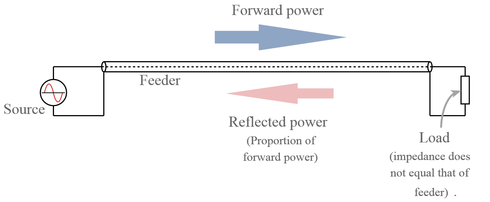
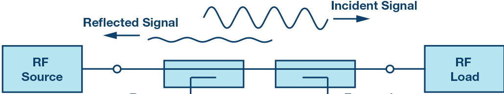
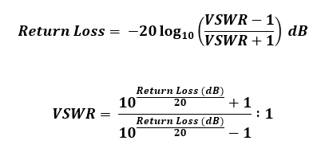
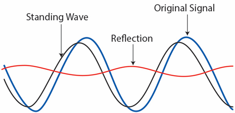

## VSWR and Return Loss

https://www.youtube.com/watch?v=BijMGKbT0Wk

**VWSR** and **Return Loss** are both related to the transfer of RF power.

Some symbols:  
Z	= 	impedance  
R	= 	resistance  
$X_{L}$	= 	inductive reactance  
$X_{C}$	= 	capacitive reactance  

### VSWR  - Voltage Standing Wave Ratio (pronounced "vizwarr")

Defined as the ratio of the maximum to the minimum voltage on a loss-less line. It tells the severity of standing waves in a transmission line. Expressed as 3.0:1, 2.0:1. Higher is the value of VSWR higher is the mismatch. 

Perfectly Matched or Ideal VSWR is 1:1.

Complete Impedance Mismatch VSWR is ∞:1.

Maximum power is transferred when the Source of the power and the Load of the power have impedances that are *Matched*. (e.g. 50 $\Omega$ on both sides)

When *Matched* all the power provided by the *Source* is absorbed by the *Load*.

- RF systems are typically 50 $\Omega$
- Cable TV systems are typically 75 $\Omega$

in Impedance Mismatch (50 $\Omega$ to 75 $\Omega$) causes some of the Forward Power to be reflected back to the Source. (Reflected or Reversed power)
- Reflected Power is almost always undesireable
- standing waves can cause heating effects in the cable or damage to the transmitter

Impedances are typically thought of as Resistive Powers, but in practice these are Complex values.

They consist of a:
- *Resistive* (Real) part. Symbolized as: *R*
- *Reactive* (Imaginary) part. Symbolized as *jZ*

R - (resistive)
jZ - (reactive)

So the formula is:  **R + jZ $\Omega$**

A *Complex Impedance* is *Matched* by a *Complex Conjugate* in which the sign of the imaginary part is reversed.  
e.g.

(source)  ---------------------- (load)  
35 + j6 $\Omega$ is matched to 35 - j6 $\Omega$

### Impedance

*Impedance* is a complex value that consists of
- Resistance (R) which does not change with frequency 
- Reactance (X) which does change with frequency
    - Two types of Reactance, created by Capacitors and Inductors
        - Capacitative (C) (+X)
        - Inductive (L) (-X)

So Impedance Z is point on a coordinate graph determined by R and X.

So Complex Impedance is both a Magnitude and a Directional.

Because of Reactance, total Impedance varies by Frequency.

- Dummy loads are very resistive loads designed to have a constant impedance over a wide frequency range.
- Antennas have a resistance that changes substantially by frequency. They are only used for specific frequencies.
    - Antenna impedance in real world applications is dependant on placement relative to a Ground Plane or other nearby objects

So with a Dummy Load the relative reflected power stays low and consistent over a variety of frequencies. In this example the frequency changes, but the reflected power stays the same.  

Example:  
| Freq | Reflected Power | 
| ----------- | ----------- | 
| 100mhz |  1w |  
| 200mhz |  1w |  
| 500mhz |  1w |  
| 1ghz |  1w |  

But with an Antenna the level of reflected power is a function of the Frequency, relative to the capabilities of the antenna. So the amount of bad power returning will be higher at non-optimal antenna frequencies and lower for optimal antenna frequencies.

in this case:  
| Freq | Reflected Power |  
| ----------- | ----------- |
| 100mhz |  4w |  
| 200mhz |  <1w |  
| 500mhz |  25w |  
| 1ghz |  50w |  

Real world devices fall in between the two cases of:
- Little impedance variation by frequency
- Large or Irregular impedance variation by frequency

#### Quantifying Reflected Power relative to Forward Power

Two Methods:
- return loss
- VSWR 

### Return Loss - the difference in dB between the Forward and Reflected power

forward power - return power == return loss

If forward power is 50dBm and reflected power is 10dBm, return loss == 40dB

Larger values for return loss mean the less power is reflected, so we want the value of Return Loss to be as large as possible.

The value must always be a positive number since the level of reflected power is always less than the level of forward power.

Even in the cast where 100% of the forward power is lost, some power will be lost on the path from the source to the load, so reflected power can never be 100%

**standing waves**

Forward signal  - signal from Source to Load
Reverse/Reflected signal  - signal not absorbed by the Load
Standing Wave - 
forward + reverse signal - standing wave  

VSwR is measure of the highest and lowest ratios in the standing wave.

VSWR = $\frac{Vmax} {Vmin}$

so if Vmax == 3 and Vmin == 1, VSWR == 3

### Reflection

Reflection can be quantified by means of a Reflection Coefficient $\Gamma$

Reflection coefficient or  “Γ” describes the tendency of the forward wave to reflect back towards the transmitter instead of being absorbed by the load. This depends on the load, $Z_{L}$ and cable impedance, $Z_{0}$ described by the equation $\frac{Z_{L} -  Z_{0}} {Z_{L} +  Z_{0}}$ (Γ = $Z_{L}$ − $Z_{0}$ / $Z_{L}$ + $Z_{0}$ )

By substituting various values we can summarise what happens to Γ when we change the value of the load as follows:

|Load, $Z_{L}$ | Reflection coefficient, Γ  | % Reflected power|
| ----------- | ----------- | ----------- |
|Open circuit |	+1 |	100% |
|$Z_{L}$ = $Z_{0}$ |	0 	| 0% |
|Short circuit |	-1 	| 100%, inverted|

- The reflection coefficient can only be between -1 and +1.
- The reflection coefficient should be zero when there is no reflection.

Once we know the reflection coefficient, Γ we can calculate VSWR through this equation. The |Γ| represents the magnitude only (in the above table, both”+1″ and “-1” are equivalent to “1”).

|Load, $Z_{L}$ | Reflection coefficient, \|Γ\| | % Reflected power | VSWR|
| ----------- | ----------- | ----------- | ----------- |
Open circuit or short circuit |	1 	|100%  | ∞ | 
||	0.8| 	64% |	9.0| 
||	0.6| 	36% |	4.0|
||	0.4 |	16% |	2.3|
||	0.2 |	4% 	|1.5|
|$Z_{L}$ = $Z_{0}$ 	|0 	|0%| 	1| 

The VSWR ranges from 1 or 1:1 (ideal) to infinity. When the load or antenna impedance, Z (whether real or complex) changes we get different values of VSWR that fall in this range. In particular since antenna impedance depends on the dimensions of its conductors which are themselves measured in wavelengths of the operating frequency, there will be an optimum design frequency where the antenna is closely matched to Zo and produce a low VSWR.

--

So $\Gamma$ is a function of the Load Impedance $Z_{L}$ and the Source Impedance $Z_{0}$

$\Gamma$ = $\frac{Z_{L} -  Z_{0}} {Z_{L} +  Z_{0}}$

$\Gamma$ is then used to calculate VSWR:

VSWR = $\frac{1 + |\Gamma|} {1 - |\Gamma|}$

VSWR can also be calculated from Return Loss and Vice Versa:

Return Loss = $20log_{10}$$\left \frac{VSWR + 1}{VSWR - 1}\right$

or 

Return Loss = $20log_{10}$$( \frac{VSWR + 1}{VSWR - 1})$

if $\Gamma$ == 0.0, then the impedances match and there is no reflected power.

As VSWR increases $\Gamma$ increases and the % of reflected power increases
- at VSWR 3 / $\Gamma$ 5 there's 25% reflected power 
- this still an ok threshold for many applications

e.g.

| VSWR      | ( $\Gamma$ ) | % of reflected power |
| ----------- | ----------- | ----------- |
| 1.0      | 0.0      | 0.0 |
| 1.5   | 0.200        | 4.0 |
| 2.0 | .333 | 11.1 | 
| 3.0 | .500 | 25.0 | 
| 4.0 | .600 | 36.0| 
| 5.0 | .667 | 44.0| 
| 6.0 | .714 | 51.0| 
| 7.0 | .750 | 56.3 | 
| 8.0 | .778| 60.5 | 
| 9.0 | .800 | 64.0| 
| 10.0 |.818  | 66.9| 
| 15.0 | .875| 76.6| 
| 20.0 |.905 | 81.9| 
 

Two Special Cases of VSWR:
- short circuit $Z_{L}$ = 0 and $\Gamma$ = -1
- open circuit $Z_{L}$ = $\infty$ and $\Gamma$ = 1 

In both cases VSWR = $\infty$ which means that 100% of the forward power is being reflected back to the source.

### Dealing with Reflected Power

**Matching Network**

In the case:

Source -> Load  
50 + j0 $\Omega$ -> 39 + j6 $\Omega$ 

A Matching Network can be added. Adds Impedances (capacitance and inductance) to "match" source and load impedance.

Source -> Matching Network -> Load
- 23.415nH Inductor + 19.905pF Capacitor

**Foldback**
- reducing forward power also reduces reflected power
    - primarily used in higher power sources like broadband amplifiers
- protects the source from dangerous levels of reflected power
    - can cause performance degredation and sometimes permanent damage

In this case:

If you have a *Source*  with a Max Safe Reflected Power of 40w:

- At VSWR 1.5 with 100w of Forward Power only 4w will be reflected back to source.
- At VSWR 6, the reflected power of 50w would exceed the safe limit.
    - if this is limited to 80w @ VSWR 6, reflected power is down to 40w - the max safe limit

## Antenna notes:

When adjusting the dipole length, the resonant point occurs when reactance “X” drops to near zero as seen in the following table:

| Dipole length, L | Reactance, X | Impedance, Z| 
| ---- | ---- | --- |
| L > λ/2 | +X | Antenna is Inductive | 
| L = λ/2 | 0 | Antenna is Resonant, Z = 72Ω | 
| L < λ/2 | -X | Antenna is Capacitive | 

Making a dipole length longer or shorter than 1/2 wavelength will increase the reactance and the antenna will not be properly matched to the rest of the system. 

In some applications where the environment does not permit full size antennas to be installed, one would have to use antennas shorter than half wavelength (making the antenna more capacitive). 

By adding some inductance in the form of a “loading coil” to the base, this extra capacitance can be cancelled out.

## Other notes and links
- https://en.wikipedia.org/wiki/Standing_wave_ratio
- https://www.everythingrf.com/community/vswr-vs-return-loss
- https://www.cdt21.com/design_guide/impedance-and-standing-wave-ratio/

